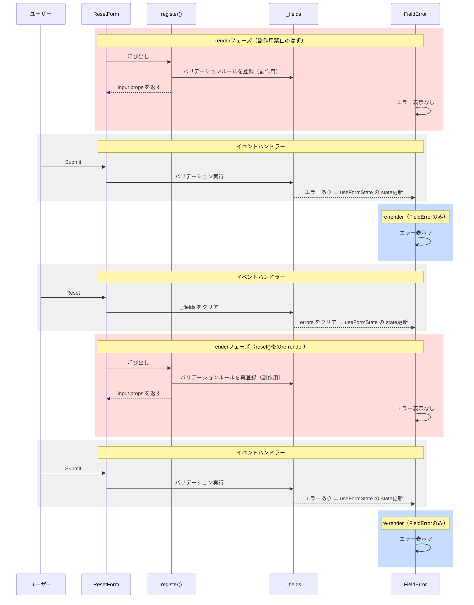
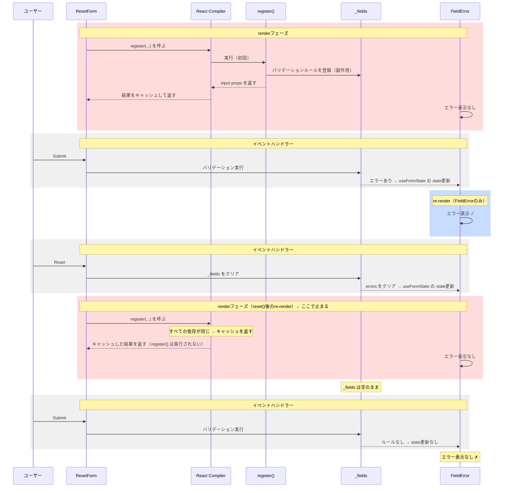

## はじめに

[React Hook Form](https://react-hook-form.com/) を利用したアプリケーションで [React Compiler](https://ja.react.dev/learn/react-compiler/introduction) を有効にすると意図しない動作になることがあります。たとえばformリセット後の再送信でバリデーションエラー表示されないという問題が起こりえます。このReact Compilerを有効化する上での問題はReact Hook Formのリポジトリーでも以下のissueで報告されています。

https://github.com/react-hook-form/react-hook-form/issues/12298

ここではなぜこのような問題が起きるのかを整理してみたいと思います。

:::message
この記事では、それぞれ以下のバージョン時点での言及になります。
React Hook Form: v7.72.0
React: v19.2.4
babel-plugin-react-compiler: v1.0.0
eslint-plugin-react-hooks: v7.0.1
:::

## どのように壊れるか

実際に意図しない動作になる例を以下のリポジトリーで用意してみたので、この例を参考に進めていきます。

https://github.com/makotot/react-hook-form-react-compiler-reproduce 

[`reset()` を使ったformがあります](https://github.com/makotot/react-hook-form-react-compiler-reproduce/blob/9468cf86c28d7ea84a503af6a4a98d7280c959f3/src/ResetForm.tsx)が、バリデーションエラーになったら`FieldError`コンポーネントでそのエラーメッセージを表示するようになっています。

```tsx
function ResetForm() {
  const { register, handleSubmit, reset, control } = useForm({
    defaultValues: { email: "" },
  });

  return (
    <form onSubmit={handleSubmit(() => {})}>
      <input
        {...register("email", { required: "Email is required" })}
      />
      <FieldError name="email" control={control} />
      <button type="submit">Submit</button>
      <button type="button" onClick={() => reset()}>Reset</button>
    </form>
  );
}

function FieldError({ name, control }) {
  const { errors } = useFormState({ control });
  const error = errors[name];
  if (!error) return null;
  return <span>{error.message}</span>;
}
```

[`register()`](https://react-hook-form.com/docs/useform/register) は `<input>` に渡すpropsを返すだけでなく、関数の戻り値とは別に外部の状態を変更するという副作用も持っています[^2]。

React Compilerを有効にしている状態では、1回目の送信後にバリデーションエラーが表示されますが、その後リセットし、再度送信するとバリデーションエラーは表示されません。
React Compilerを無効にすると（再現リポジトリーでは `vite.config.ts` から `babel({ presets: [reactCompilerPreset()] })` を取り除くことで無効化できます）、1回目はもちろん、2回目以降もバリデーションエラーが正常に表示されます。

| 送信後のバリデーションエラー表示 | Compilerなし | Compilerあり |
|---|---|---|
| 1回目 | ✓ | ✓ |
| 2回目 | ✓ | ✗ |

## React Hook Form はどう動くか

なぜ挙動の違いが生まれるのでしょうか。まずReact Compilerなしの状態で、従来のReact Hook Formがどう動くか、上述のコード例をmermaid図で表現してみます。



[`reset()`](https://react-hook-form.com/docs/useform/reset) はフォームを初期状態へ戻すAPIで、`_fields` を含む内部状態をクリアします。次のrenderで `register()` が再実行されフィールドが再登録される前提になっています。

`_fields` はReact Hook Form内部で管理するクロージャー変数となっていて[^1]、バリデーションルールを保持します。`register("email", { required: "..." })` を呼ぶたびにフィールド名をキーとしてエントリーが登録されます。

再現リポジトリーで `console.log(JSON.stringify(control._fields, ...))` により確認した `register()` 呼び出し後の `_fields` の内容は以下の通りです。

```js
{
  "email": {
    "_f": {
      "ref": HTMLInputElement, // DOM要素のため HTMLInputElement と表記
      "name": "email",
      "mount": true,
      "required": "Email is required", // register() に渡したバリデーションルール
      // validate などの関数はJSON非シリアライズのため省略
    }
  }
}
```

`handleSubmit` はsubmit時にこの `_fields` からバリデーションルールを取得して実行します[^9][^10]。内部的には `handleSubmit` がエラー状態の変化を `useFormState` へ通知し、stateが更新されることでre-renderが起きると考えられます。`_fields` が空のままだとバリデーションルール自体が存在しないため、エラーは検出されず表示されません。

`register`により副作用を避けるべきrenderフェーズで `_fields` へのバリデーションルールの登録が行われ、renderのたびに同様のことを繰り返しています。renderフェーズはStrict Modeによる二重呼び出しやConcurrent Modeのrenderの中断・再開などにより複数回実行されることがあるため、副作用は本来禁止されています[^3]。React Hook Formは、不要なre-renderを極力避けるためにstateを使わずに[ref](https://github.com/react-hook-form/react-hook-form/blob/v7.72.0/src/useForm.ts#L51)と[クロージャー](https://github.com/react-hook-form/react-hook-form/blob/v7.72.0/src/logic/createFormControl.ts#L142)で状態を管理するという設計を選択[^8]していて、レンダリングを最適化できる利点がありました。ただしこの設計は、renderフェーズに副作用を持つことにもなり、React Compilerとの衝突へとつながります。

## React Compilerが有効になると

では、React Compilerが有効な状態ではどうなるでしょう。mermaid図にReact Compilerをアクターとして追加してみます。



React Compilerは[Reactのルール](https://react.dev/reference/rules/components-and-hooks-must-be-pure)に従ってrenderが純粋であることを前提とし、式ごとにすべての依存を追跡して、いずれも変化がなければ関数呼び出しの結果をキャッシュして再実行しません[^4]。`register` はReact Hook Formが内部で `useRef` を使って管理するオブジェクトのメソッドであるため[^5]、レンダーをまたいで参照が変わりません。再現リポジトリーのビルド出力では、`register()` の呼び出しに対して `register` 参照が `===` で比較されており、文字列引数などは定数として扱われるためこの比較だけでキャッシュの有無が判定されています。

```js
// ビルド出力（minify済みのため変数名は短縮されている）
e[4]===n?c=e[5]:(c=n(`email`,{validate:ht}),e[4]=n,e[5]=c);
// n = register、e[4] = 前回の register 参照、e[5] = 前回の register(...) の戻り値
// e[4]===n が true なら register() を実行せず e[5] をそのまま返す
```

結果として [`reset()`](https://react-hook-form.com/docs/useform/reset) 後のre-renderで `_fields` が再構築されず、次の送信時にバリデーションルールが存在しないためエラー表示されません。

なお、[`watch`](https://react-hook-form.com/docs/useform/watch) APIについてはReact Compilerが [`react-hooks/incompatible-library` ESLintルール](https://react.dev/reference/eslint-plugin-react-hooks/lints/incompatible-library)で検知し、そのコンポーネントのメモ化を自動でスキップすることが可能になっています。この検知はセマンティック解析ではなく、デフォルト設定では [`DefaultModuleTypeProvider.ts`](https://github.com/facebook/react/blob/1b45e2439289fd8e094c44161c89e06c5488671e/compiler/packages/babel-plugin-react-compiler/src/HIR/DefaultModuleTypeProvider.ts) に非互換なAPIを明示的に登録する方式で行われています。`watch` はこのリストに `knownIncompatible` として登録されていますが、`register` は登録されていません。そのため、`register` の副作用が `reset()` 後に再実行されないという問題は静的に検知されず、意図しない動作へと繋がってしまいます。

## まとめ

この問題についてReact公式ドキュメントでは次のように述べています。

> These libraries were designed before React's memoization rules were fully documented. They made the correct choices at the time to optimize for ergonomic ways to keep components just the right amount of reactive as app state changes. While these legacy patterns worked, we have since discovered that it's incompatible with React's programming model. We will continue working with library authors to migrate these libraries to use patterns that follow the Rules of React.
>
> https://react.dev/reference/eslint-plugin-react-hooks/lints/incompatible-library

[日本語版](https://ja.react.dev/reference/eslint-plugin-react-hooks/lints/incompatible-library)には翻訳がまだなかったので英語版からそのまま引用しますが、当時の判断としてはどちらも批判できるものではなく、ルールの強制という形でReactが進化したことで潜在的な非互換性が顕在化した、という経緯が読み取れます。
ライブラリーを選定する際には、そのライブラリーの設計がプラットフォームの設計と矛盾していないかを把握しておくことが重要です。当初は問題なく動いていたとしても、プラットフォームがルールを強制する方向へ進化したとき、避けられたかもしれない問題として表面化する、という1つの例です。

React CompilerはすでにReact 19と合わせて安定版がリリースされており、[公式ドキュメントでも導入が推奨されています](https://ja.react.dev/learn/react-compiler/introduction)。また、公式ドキュメントでは次のようにも述べられています。

> コンパイラは現在は React の任意機能ですが、将来的には一部の機能を完全に動作させるためにコンパイラが必要になる可能性があります。
>
> https://ja.react.dev/learn/react-compiler/introduction

今後の方向性を踏まえると、React Compilerの導入は避けがたいものになっていくと考えられます。
React Hook FormとReact Compilerを共存させたい場合は、[`"use no memo"`](https://react.dev/reference/react-compiler/directives/use-no-memo) でコンポーネント単位でオプトアウトする選択肢があります。あるいはReact Hook Formのアップデートを待ってからReact Compiler有効化という選択肢もあります。[Issue #12298](https://github.com/react-hook-form/react-hook-form/issues/12298) でも議論が続いており、v8の開発が進んでいますが、現時点でリリース時期は明らかになっていません。
React Hook Formとの共存をしない方向であれば、React Compilerと相性の良いライブラリーへの移行であったり外部のFormライブラリーへの依存自体しないようにする等の選択肢があるでしょう。

[^1]: https://github.com/react-hook-form/react-hook-form/blob/v7.72.0/src/logic/createFormControl.ts#L142
[^2]: https://github.com/react-hook-form/react-hook-form/blob/v7.72.0/src/logic/createFormControl.ts#L1253
[^3]: https://ja.react.dev/reference/rules/components-and-hooks-must-be-pure#side-effects-must-run-outside-of-render
[^4]: "React Compiler はメモ化と同等の処理を自動的に適用し、状態が変更されてもアプリの関連部分のみが再レンダーされることを保証します。" https://ja.react.dev/learn/react-compiler/introduction#optimizing-re-renders
[^5]: https://github.com/react-hook-form/react-hook-form/blob/v7.72.0/src/useForm.ts#L51
[^8]: https://dev.to/bluebill1049/uncontrolled-form-for-react-2b3n
[^9]: https://github.com/react-hook-form/react-hook-form/blob/v7.72.0/src/logic/createFormControl.ts#L1400
[^10]: https://github.com/react-hook-form/react-hook-form/blob/v7.72.0/src/logic/createFormControl.ts#L532
