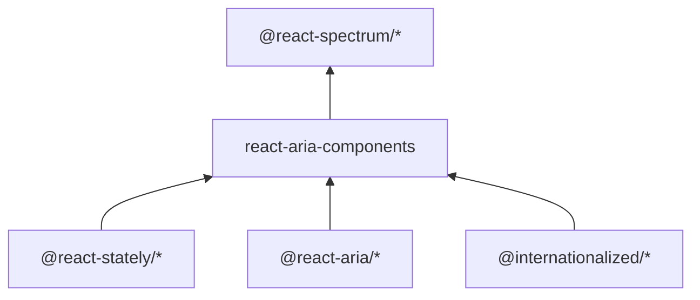

[2026年5月時点のreact-spectrumプロジェクト](https://github.com/adobe/react-spectrum/tree/6ffb87e7d6f9083b3566d881deea5296fb38aa28)は、以下のパッケージ群で構成されています。

| パッケージ                   | 役割                                           |
| ----------------------- | -------------------------------------------- |
| `@react-stately/*`      | State hookの実装。プラットフォーム非依存の状態管理               |
| `@react-aria/*`         | Behavior hookの実装。Web向けのARIA・イベント処理・アクセシビリティー |
| `react-stately`         | `@react-stately/*`を全まとめした再エクスポートパッケージ        |
| `react-aria`            | `@react-aria/*`を全まとめした再エクスポートパッケージ           |
| `react-aria-components` | DOM構造込みのコンポーネント                              |
| `@react-spectrum/*`     | Adobe Spectrumのスタイルが適用されたコンポーネント             |
| `@internationalized/*`  | React非依存のロケール対応ユーティリティー                      |

各パッケージの関係を示すと、以下のようになります。



## 設計の背景

### 3層のパッケージ構成（2019年）

2019年に書かれた[React Spectrum v3 ArchitectureのRFC](https://github.com/adobe/react-spectrum/blob/6ffb87e7d6f9083b3566d881deea5296fb38aa28/rfcs/2019-v3-architecture.md#architecture)によると、React v16.8から利用可能になったHookを用いて、コンポーネントを3つのパーツで構成するイメージを示していました。

- State hook: プラットフォーム非依存の状態管理を担う。
- Behavior hook: 特定のプラットフォーム向けのイベントハンドリング、フォーカス管理、国際化など、ヘッドレスな振る舞いを担う。
- Themed component: アプリケーションで利用する実際のコンポーネント層。

コンポーネントとState hookとBehavior hookを切り離すことで、React Spectrum以外でもState hookとBehavior hookを活用できるようにパッケージが分けられます。

また、それぞれ以下のようなパッケージ名をイメージしていることも[記載](https://github.com/adobe/react-spectrum/blob/6ffb87e7d6f9083b3566d881deea5296fb38aa28/rfcs/2019-v3-architecture.md#packages-and-file-structure)があります。

> - `@react-state/combo-box` - state hook
> - `@react-aria/combo-box` - behavior hook implementation for web
> - `@react-spectrum/combo-box` - themed spectrum component

RFC執筆時点では `@react-state` と仮称されていましたが、実際のパッケージスコープは `@react-stately` になっています。

### react-aria-componentsの追加（2023年）

`react-aria-components`は、2023年の[RFC](https://github.com/adobe/react-spectrum/blob/6ffb87e7d6f9083b3566d881deea5296fb38aa28/rfcs/2023-react-aria-components.md)で提案されたもので、HookのAPIよりも後発のものです。
React Ariaの採用が広がっていく中で、低レベルAPIの急な学習曲線、APIの複雑さへの不満を受けて、より高レベルなヘッドレスコンポーネントの提供を意図したものとなっています。

## 今後の方向性

2025年8月に[依存関係を整理するRFC](https://github.com/adobe/react-spectrum/blob/6ffb87e7d6f9083b3566d881deea5296fb38aa28/rfcs/2025-dependencies.md)が出されています。
現状では、`react-aria-components`をインストールすると`@react-aria/*`や`@react-stately/*`の個別パッケージが間接的な依存として大量にインストールされます。
バージョンアップ時にパッケージマネージャーが旧バージョンをロックファイルに残して重複インストールする問題が起きやすいです。
たとえば`@react-aria/utils`が2バージョン重複すると、グローバルなイベントリスナーの管理が2つのインスタンスに分裂し、一方が登録したリスナーをもう一方が認識できない状態になります。パッケージのバージョンを固定しているにもかかわらず重複が解消できないといった問題が報告されています[^1]。
これらを解消するため、個別パッケージのコードをモノリシックパッケージに集約し、コンポーネントごとの[sub-path exports](https://github.com/adobe/react-spectrum/blob/6ffb87e7d6f9083b3566d881deea5296fb38aa28/rfcs/2025-dependencies.md#sub-path-exports)を提供する方向で議論されています。
RFCでは個別パッケージを次のメジャーバージョンまでメンテナンスし、そのタイミングで非推奨にする見通しが示されており、将来的には以下のようなimportの変更が必要になる可能性があります。

```diff
- import {useButton} from '@react-aria/button';
+ import {useButton} from 'react-aria/button';
```

[^1]: https://github.com/adobe/react-spectrum/discussions/7675
