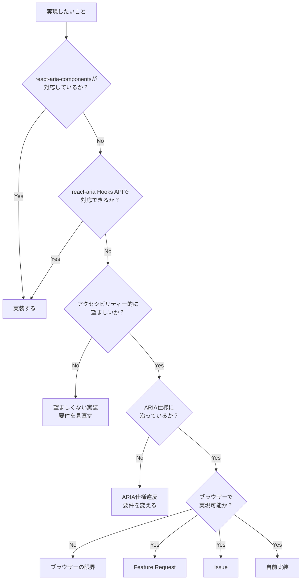

React Ariaを利用することで得られるものと、得られないものは何でしょうか。
[公式ドキュメントのQualityのページ](https://react-aria.adobe.com/quality)によると、アクセシビリティー・国際化・インタラクションの3つを核として設計されていて、これらについて恩恵を得られます。一方で、唯一の「正しいアクセシビリティー実装」は得られるものではありません。

## アクセシビリティー

[WAI-ARIA](https://www.w3.org/TR/wai-aria/)と[APG（ARIA Authoring Practices Guide）](https://www.w3.org/WAI/ARIA/apg/)に基づいた適切なHTML要素とARIA属性の組み合わせ・キーボード操作・フォーカス管理が提供されているため、開発者がこれらを1から実装する必要がありません。macOS・Windows・iOS・AndroidのデスクトップおよびモバイルOS上の主要なスクリーンリーダーで検証済みであり、ブラウザー・OS間の差異も内部で吸収されています。

## 国際化

30以上の言語のローカライズ済み文字列、グレゴリオ暦・仏教暦・イスラム暦・ペルシア暦を含む複数の暦体系、RTLレイアウトへの対応が組み込まれています。ユーザーの言語を自動で検出し、`I18nProvider`で特定のロケールを上書き指定することもできます。React Ariaのコンポーネントが内包するテキストの多言語対応を自前で用意する必要がありません。

## インタラクション

マウス・タッチ・キーボード・スクリーンリーダーの4つの入力方式において、`press`・`hover`・`focus`といった対話状態がブラウザーや入力方式の差異に関わらず正規化されて提供されます。デバイスごとの挙動の差異を自前で吸収する実装をする必要がなく、デスクトップからモバイル・テレビに至るまで一貫したインタラクションが可能となります。

## 唯一の正解ではない

React Ariaはアクセシビリティーに配慮したライブラリーですが、唯一の「正しいアクセシビリティー」というわけではないことに留意する必要があります。opinionatedな実装であり[^1]、WAI-ARIAの解釈に余地もあります。React Ariaで実現できないからといってアクセシビリティー的に拙い実装とも限らず、APGにパターンがない[^2]からといって望ましくない実装とも限りません。

react-ariaで要件を実現できないとき、何を根拠に判断するかは一概ではありません。

[^1]: メンテナーは「WAI-ARIA is just guidelines/ideas, it doesn't have to be implemented that way」と明言した上で、TagGroupの実装がAPGパターンと意図的に異なることを説明しています（[Discussion #9533](https://github.com/adobe/react-spectrum/discussions/9533)）。また、各コンポーネントのAPGとの差異をドキュメント化したいという意向も示されています（[Discussion #9386](https://github.com/adobe/react-spectrum/discussions/9386)）。
[^2]: APGはARIAの使用パターンを示すための例示集であり、規範でも唯一の正解でもありません。ARIAを過度に使った例が含まれるといった批判もあります。参考: [Notes on relying on the ARIA Authoring Practices Guide](https://www.stefanjudis.com/notes/notes-on-relying-on-the-aria-authoring-practices-guide/)
