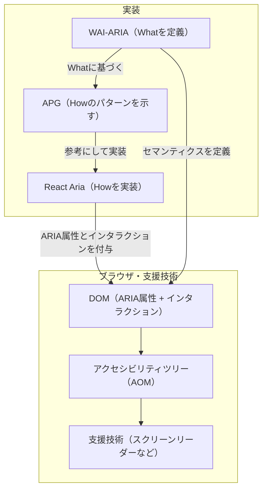

React Ariaを理解する上で、WAI-ARIAとアクセシビリティツリーの基礎を押さえておくと、ライブラリが何を代わりにやってくれているのかがわかりやすくなります。

## WAI-ARIA・APG・React Ariaの連鎖

React Ariaを理解するには、まず3つの仕様・ライブラリの役割を把握しておくと整理しやすいです。

| 仕様・ライブラリ | 役割 |
|---|---|
| WAI-ARIA | UIの意味論（What）を定義する仕様。アクセシビリティツリーへのセマンティクス付与 |
| APG | そのWhatに対応するHow（キーボード操作・フォーカス管理など）のパターンを示すガイドライン。強制ではない |
| React Aria | APGのパターンを参考にしながらHowを実装したライブラリ |

WAI-ARIAでWhatが確定すると、そのWhatに対応するHowのパターンをAPGが示します。

```
WAI-ARIAでWhat確定（例: role="combobox"）
    ↓
APGがそのWhatに対応するHowのパターンを示す（Escapeで閉じる、↑↓で選択移動など）
    ↓
React AriaがそのHowを実装
```

React AriaはこのWhatとHowのペアを丸ごと提供するライブラリです。開発者がARIAのWhat設定・キーボード操作・フォーカス管理を個別に実装する必要がなくなります。



この連鎖を理解するには、まずWAI-ARIAが何に作用しているかを知る必要があります。その対象がアクセシビリティツリーです。

## アクセシビリティツリー

ブラウザがHTMLを解析すると、[DOM](https://dom.spec.whatwg.org/)・[CSSOM](https://www.w3.org/TR/cssom-1/)・[AOM](https://github.com/WICG/aom)という3つのオブジェクトモデルが構築されます。いずれもDOMを起点としていますが、それぞれ異なる目的を担います。AOM（Accessibility Object Model）とはアクセシビリティツリーをオブジェクトモデルとして表現したもので、CSSに対するCSSOMと同様の関係です。

| | 役割 |
|---|---|
| **DOM** | HTMLをパースして構築。他の2つの元になる |
| **CSSOM** | CSSをパースして構築。DOMと合わさってレンダーツリーになり視覚表現を担う |
| **AOM** | DOM + WAI-ARIA属性 + 暗黙のセマンティクスから構築。支援技術への意味表現を担う |

ブラウザはDOMとWAI-ARIAから[アクセシビリティツリー](https://developer.mozilla.org/ja/docs/Glossary/Accessibility_tree)を構築します。
このアクセシビリティツリーはスクリーンリーダーなどの支援技術が読む構造で、各ノードは以下の情報を持ちます。

| | 内容 |
|---|---|
| **Name** | 読み上げる名前（例：「Read more」というリンクのNameは「Read more」） |
| **Description** | Nameに加える補足説明 |
| **Role** | 何者か（button、dialog、comboboxなど） |
| **State** | 今どういう状態か（expanded、checked、selectedなど） |

```
DOM + WAI-ARIA → [ブラウザが変換] → アクセシビリティツリー → スクリーンリーダーなどの支援技術
```

WAI-ARIAの `role` と `aria-*` 属性はそのままアクセシビリティツリーのノード属性に対応しています。ネイティブHTML要素（`<button>`・`<select>`など）はブラウザが暗黙のARIAロールを持っているため、WAI-ARIAを明示しなくても支援技術が識別できます。カスタムUIには対応する暗黙のロールがないので、WAI-ARIAで明示的にツリーのノードを定義する必要があります。

実際にどのようなツリーが構築されているかはブラウザのDevToolsで確認できます。Chromeでは、Elementsパネル内のAccessibilityタブの「Show accessibility tree」トグル[^chrome-a11y-devtools]、Firefoxでは独立したAccessibilityタブから確認できます。

アクセシビリティツリーに関する仕様は単一のドキュメントにまとまっているわけではなく、複数にわたっています。

| 仕様 | 役割 |
|---|---|
| [WAI-ARIA](https://www.w3.org/TR/wai-aria/) | ツリーの抽象モデルを定義 |
| [Accessible Name and Description Computation](https://www.w3.org/TR/accname/) | ノードの名前・説明の算出ルールを定義 |
| [Core-AAM](https://www.w3.org/TR/core-aam/) | モデルをmacOS・WindowsなどのプラットフォームAPIへマッピング |
| [HTML-AAM](https://www.w3.org/TR/html-aam/) | HTML要素とARIAのロール・ステートの対応を定義 |

## WAI-ARIA

[WAI-ARIA](https://www.w3.org/TR/wai-aria/)[^wai-aria]は、UIの意味論、「What（何者か・どういう状態か）」を定義する仕様です。
W3Cの[WAI-ARIAの概要](https://www.w3.org/WAI/standards-guidelines/aria/)では以下のように説明されています。

> It especially helps with dynamic content and advanced user interface controls developed with HTML, JavaScript, and related technologies.

HTMLとJavaScriptで構築する動的コンテンツや高度なUIコントロールに対して、アクセシビリティを補う手段として特に有効と示してます。
ネイティブのHTML要素（`<button>`、`<select>`など）はブラウザが暗黙のロールとセマンティクスを持っています。一方、`<div>` や `<span>` をベースにJavaScriptで作るカスタムUIには暗黙のロールがないため、スクリーンリーダーのような支援技術はその要素が何であるかを判断できません。
WAI-ARIAで明示的にロールやセマンティクスを付与することで、支援技術が正しく解釈できるようになります。

同ページの「Technical solutions」セクションでは、WAI-ARIAが提供するものを次のように説明しています。

> WAI-ARIA provides a framework for adding attributes to identify features for user interaction, how they relate to each other, and their current state.

WAI-ARIAについて、ユーザー操作に関わる要素の特性・要素間の関係・現在の状態を属性として付与するための枠組みである、としています。

```html
<div role="button" aria-pressed="true" aria-label="お気に入り">
```

この例では、HTML要素としては`<div>`だけど「これはボタンで、押された状態で、ラベルはお気に入り」というWhatを伝えています。しかしキーボード操作やフォーカス管理といったHow（どう動くか）については、WAI-ARIAの守備範囲外です。

WAI-ARIAがWhatだけなのは層が違うからです。WAI-ARIAはブラウザがアクセシビリティツリーを構築する際に参照するセマンティクスを定義する仕様であり、JavaScriptのイベントやフォーカス制御には技術的に届きません。

### WAI-ARIAの属性カテゴリ

WAI-ARIAの属性は3つに分類できます。

**`role` — 要素の役割（名詞）**

```html
role="button"
role="dialog"
role="combobox"
role="menu" / "menuitem"
role="tab" / "tablist" / "tabpanel"
role="alert"          <!-- ライブリージョン -->
role="banner" / "main" / "navigation"  <!-- ランドマーク -->
```

**`aria-*` states — 今の状態（形容詞）。変化する**

```html
aria-expanded="true/false"   <!-- 開閉 -->
aria-checked="true/false"
aria-selected="true/false"
aria-disabled="true/false"
aria-hidden="true/false"
aria-pressed="true/false"    <!-- トグルボタン -->
aria-busy="true/false"       <!-- ロード中 -->
```

**`aria-*` properties — 関係・ラベル（関係詞）。静的に近い**

```html
aria-label="閉じる"
aria-labelledby="some-id"
aria-describedby="hint-id"
aria-controls="dropdown-id"
aria-live="polite/assertive"
aria-required="true"
```

これらすべてが支援技術へのアナウンス素材であり、動きは含みません。

## APG

Howのパターンを示しているのは[APG（ARIA Authoring Practices Guide）](https://www.w3.org/WAI/ARIA/apg/)です。WAI-ARIAがWhatを定義するのに対し、APGはそのWhatに対応するキーボード操作・フォーカス管理といったHowの実装パターンを示します。ガイドラインであり唯一の正解ではなく、実装には自由度があります。

[^wai-aria]: WAI-ARIAはWeb Accessibility Initiative - Accessible Rich Internet Applicationsの略。WAI（Web Accessibility Initiative）はW3C内のWebアクセシビリティを担当するイニシアチブで、そのWAIが策定したARIA仕様という構造になっている。
[^chrome-a11y-devtools]: [Accessibility features reference - Chrome DevTools](https://developer.chrome.com/docs/devtools/accessibility/reference)
